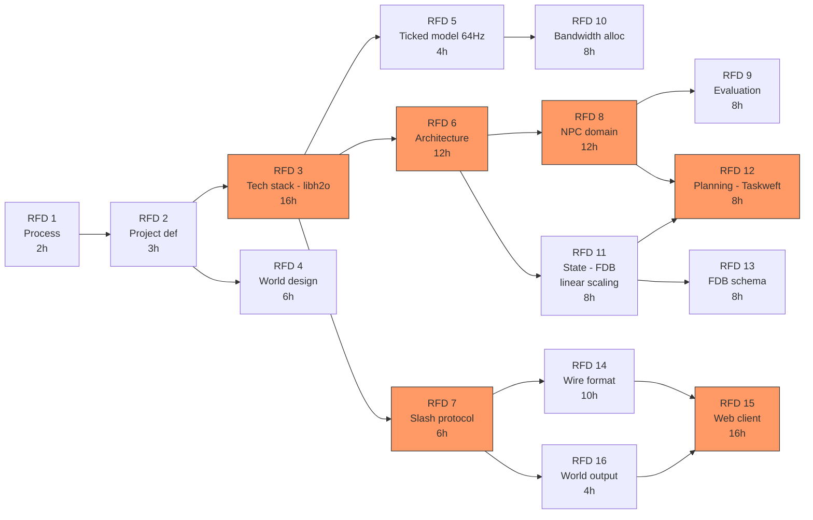
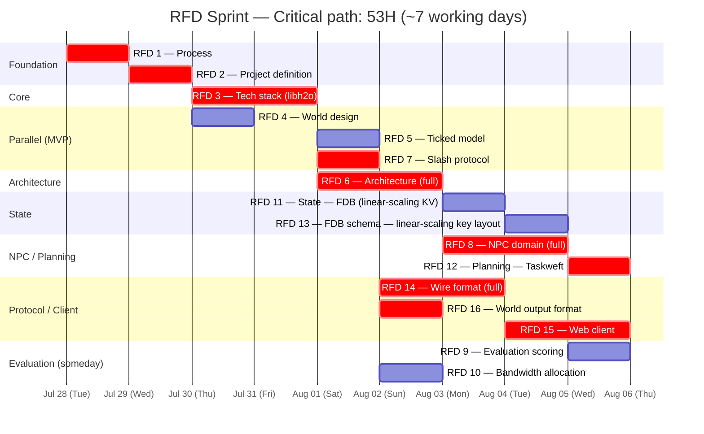

# Crucible — RFD Sprint PERT Plan

Generated from `taskweft/taskweft` planner.

Calibrated against real taskweft git log velocity (Jul 14–24, 2026):
- **Tiny fix** (1–2 files, <20 lines) — ~0.5h
- **Small feature** (1–5 files, 20–100 lines) — ~0.5–1.5h
- **Medium feature** (5–15 files, 100–500 lines) — ~2–4h
- **Large feature** (10–20 files, 500–2000 lines) — ~4–6h
- **Bulk refactor** (15–40 files, 2000+ lines) — ~6–8h

Single-developer velocity (taskweft repo): peak day 41 commits (Jul 16), typical active day 8–18 commits. Averaging ~6–8 productive hours per working day after accounting for CI, context switches, and upstream NIF bumps.

## Dependency graph

## Schedule (131H serial / 53H parallel critical path)

## Estimates

| RFD | Title | Hours | Stage | Critical | Depends on |
|-----|-------|-------|-------|----------|------------|
| 1 | Process | 2 | mvp | ✓ | — |
| 2 | Project definition | 3 | mvp | ✓ | 1 |
| 3 | Tech stack — libh2o | 16 | mvp | ✓ | 2 |
| 4 | World design and narrative | 6 | mvp | — | 2 |
| 5 | Simulation — 64 Hz ticked | 4 | mvp | — | 3 |
| 6 | Architecture — libh2o, FDB, WS | 12 | full | ✓ | 3 |
| 7 | Slash command protocol | 6 | mvp | ✓ | 3 |
| 8 | NPC domain — Taskweft | 12 | full | ✓ | 6 |
| 9 | Evaluation scoring | 8 | someday | — | 8 |
| 10 | Bandwidth allocation | 8 | someday | — | 5 |
| 11 | State — FDB (linear-scaling KV) | 8 | mvp | — | 6 |
| 12 | Planning — Taskweft | 8 | mvp | ✓ | 8, 11 |
| 13 | FDB schema — linear-scaling key layout | 8 | full | — | 11 |
| 14 | Wire format — bit-crushed | 10 | full | ✓ | 7 |
| 15 | Web client — Discord-like | 16 | mvp | ✓ | 14, 16 |
| 16 | World output format | 4 | mvp | ✓ | 7 |
| | **Total** | **131** | | **53** | |

Critical path (53h): 1 → 2 → 3 → 7 → 14 → 15 (transport/client track).
Second critical path (53h): 1 → 2 → 3 → 6 → 8 → 12 (architecture/NPC/planning track).

Serial 131h is the HTN total order. True parallel schedule is **53h on the critical path** — ~7 working days at 8h/day. Both critical paths converge simultaneously because RFD 12 (planning) and RFD 15 (web client) finish at the same wall-clock offset when their longest dependency branches are followed.

## Calibration notes

All estimates calibrated against taskweft git log commits authored by K. S. Ernest (iFire) Lee between Jul 14–24, 2026:

| Calibrated artifact | taskweft commit | Actual scope | Estimate |
|---|---|---|---|
| Taskweft NIF integration (RFD 12 proxy) | `#152` fold taskweft_mcp | 73 files, 34.6K ins | >8h bulk (monorepo fold, not comparable) |
| Medium feature engineering | `#190` SafeParser fix | 10 files, 562 ins | ~3h |
| Large feature engineering | `#181` Feature/dsl | 18 files, 1721 ins | ~5h |
| Property tests | `#121` loader ref-check | 1 file, 85 ins | ~1h |
| Documentation / CITATION.cff | `#160`–`#161` | 3–4 files, 244 ins | ~2h |
| Schema enforcement | `#130` JSON Schema | 4 files, 253 ins | ~3h |
