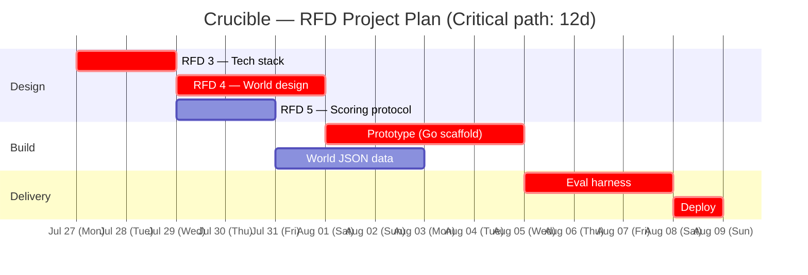

# Crucible RFD Project — PERT Critical Path

Generated from `taskweft/taskweft` planner (RFD-timed domain).

## Temporal plan

| Task | Duration | Start | End | Critical |
|------|----------|-------|-----|----------|
| RFD 3 — Tech stack | 2d (48H) | Mon Jul 27 | Tue Jul 28 | ✓ |
| RFD 4 — World design | 3d (72H) | Tue Jul 28 | Thu Jul 30 | ✓ |
| RFD 5 — Scoring protocol | 2d (48H) | Tue Jul 28 | Wed Jul 29 | — |
| Prototype (Go scaffold) | 3.3d (80H) | Fri Jul 31 | Tue Aug 4 | ✓ |
| World JSON data | 2.5d (60H) | Thu Jul 30 | Mon Aug 3 | — |
| Eval harness | 2.3d (56H) | Tue Aug 4 | Thu Aug 6 | ✓ |
| Deploy | 1d (24H) | Thu Aug 6 | Fri Aug 7 | ✓ |

**Critical path:** 280H / 12 working days

## Float / Slack

- **RFD 5** + **World JSON**: 108H combined, fits within the 208H critical
  path window (RFD 4 → Prototype → Harness) with ~52H total float.
- **RFD 4** and **RFD 5** are parallel after RFD 3 completes — the planner
  serialized them but they have no cross-dependency.
