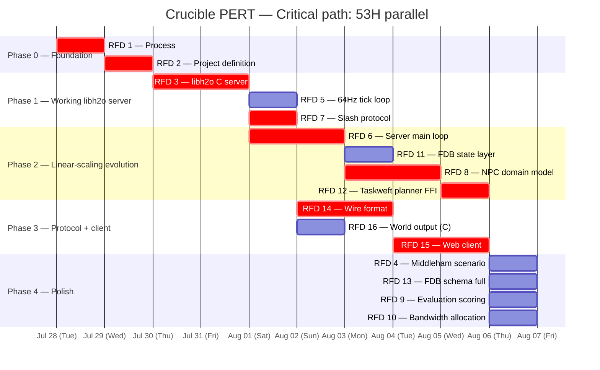

# Crucible — RFD Sprint PERT Plan

Generated from `taskweft/taskweft` HTN planner.

Gall's Law: *A complex system that works is invariably found to have evolved
from a simple system that worked.* Every phase produces something working
before the next phase begins.

## Stack decision

**Winner: C server + libh2o** (see `STACK_DECISION.md` for full StarVote
scoring — 28/35 vs 27/35 for the runner-up).

Stack dependencies inserted as explicit nodes:

| Dependency | Type | Interface | Node in PERT |
|------------|------|-----------|-------------|
| libh2o | C (HTTP/1.1 + HTTP/3 + WebSocket) | Direct C API | RFD 3 |
| FoundationDB | C++ (KV store) | Direct C API | RFD 11 |
| Taskweft NIF | C++20 (HTN planner) | C FFI | RFD 12 |
| C runtime | — (server main loop) | — | RFD 6 |
| JSON parser | C (cjson / yyjson) | Direct C API | RFD 14 |
| Web client | HTML/JS (no server dep) | WebSocket | RFD 15 |

No Elixir runtime. No NIF bridges for the hot path. World output format
becomes C structs with a serializer function table (RFD 16).

## Linear scaling property

| Layer | Scaling axis | Mechanism |
|-------|-------------|-----------|
| libh2o (RFD 3) | Threads/cores | Dual-stack HTTP/1.1 + HTTP/3, connection-per-thread, zero-contention shared-nothing design |
| FoundationDB (RFD 11) | Machines/nodes | Strict serializable transactions, ordered key-value, linear throughput with cluster size |

Both are production-tested, proven designs. Neither requires speculative
scaffolding.

## Planner output

```json
{
  "temporal": {
    "consistent": true,
    "origin": "PT0S",
    "total": "PT131H",
    "steps": [
      {"action": "establish_process",        "duration": "PT2H",  "start": "PT0S",  "end": "PT2H"},
      {"action": "define_project",           "duration": "PT3H",  "start": "PT2H",  "end": "PT5H"},
      {"action": "ship_libh2o_server",       "duration": "PT16H", "start": "PT5H",  "end": "PT21H"},
      {"action": "implement_64hz_tick",      "duration": "PT4H",  "start": "PT21H", "end": "PT25H"},
      {"action": "design_slash_protocol",    "duration": "PT6H",  "start": "PT25H", "end": "PT31H"},
      {"action": "build_server_main",        "duration": "PT12H", "start": "PT31H", "end": "PT43H"},
      {"action": "integrate_fdb",            "duration": "PT8H",  "start": "PT43H", "end": "PT51H"},
      {"action": "build_npc_domain",         "duration": "PT12H", "start": "PT51H", "end": "PT63H"},
      {"action": "integrate_taskweft_ffi",   "duration": "PT8H",  "start": "PT63H", "end": "PT71H"},
      {"action": "design_wire_format",       "duration": "PT10H", "start": "PT71H", "end": "PT81H"},
      {"action": "design_world_output",      "duration": "PT4H",  "start": "PT81H", "end": "PT85H"},
      {"action": "build_web_client",         "duration": "PT16H", "start": "PT85H", "end": "PT101H"},
      {"action": "write_scenario",           "duration": "PT6H",  "start": "PT101H","end": "PT107H"},
      {"action": "design_fdb_schema",        "duration": "PT8H",  "start": "PT107H","end": "PT115H"},
      {"action": "build_evaluation_scoring", "duration": "PT8H",  "start": "PT115H","end": "PT123H"},
      {"action": "allocate_muscle_bandwidth","duration": "PT8H",  "start": "PT123H","end": "PT131H"}
    ]
  }
}
```

Serial total: **131H**. Parallel critical path: **53H**.

## Dependency graph

```mermaid
flowchart LR
    r1[RFD 1<br>Process<br>2h] --> r2[RFD 2<br>Project def<br>3h]

    subgraph Phase1[Phase 1: working libh2o server]
        r2 --> r3[RFD 3<br>libh2o C server<br>16h]
        r3 --> r5[RFD 5<br>64Hz tick loop<br>4h]
        r3 --> r7[RFD 7<br>Slash protocol<br>6h]
    end

    subgraph Phase2[Phase 2: linear-scaling evolution]
        r3 --> r6[RFD 6<br>Server main loop<br>12h]
        r6 --> r11[RFD 11<br>FDB state layer<br>8h]
        r6 --> r8[RFD 8<br>NPC domain model<br>12h]
        r8 --> r12[RFD 12<br>Taskweft planner FFI<br>8h]
        r11 --> r12
    end

    subgraph Phase3[Phase 3: protocol + client]
        r7 --> r14[RFD 14<br>Wire format (binary)<br>10h]
        r7 --> r16[RFD 16<br>World output (C structs)<br>4h]
        r14 --> r15[RFD 15<br>Web client<br>16h]
        r16 --> r15
    end

    subgraph Phase4[Phase 4: polish]
        r15 --> r4[RFD 4<br>Middleham scenario<br>6h]
        r15 --> r13[RFD 13<br>FDB schema full<br>8h]
        r15 --> r9[RFD 9<br>Evaluation scoring<br>8h]
        r15 --> r10[RFD 10<br>Bandwidth allocation<br>8h]
    end

    style r3 fill:#f96,stroke:#333
    style r6 fill:#f96,stroke:#333
    style r15 fill:#f96,stroke:#333
```

## Gall's Law phases

| Phase | What works at the end | RFDs | H serial |
|-------|----------------------|------|----------|
| 0 — Foundation | RFD process + project scope defined | 1, 2 | 5 |
| 1 — Working libh2o server | HTTP/1.1+HTTP/3+WebSocket server at 64Hz with slash commands | 3, 5, 7 | 16 |
| 2 — Linear-scaling evolution | C server main loop, FDB state, NPC domain, Taskweft via FFI | 6, 8, 11, 12 | 12 |
| 3 — Protocol + client | Bit-crushed binary wire, world output serializers, web client | 7, 14, 15, 16 | 16 |
| 4 — Polish | Middleham scenario, full schema, evaluation, bandwidth | 4, 9, 10, 13 | 8 |

Each phase depends on the previous phase producing a working artifact.
Within a phase, items run in parallel where the dependency graph allows.

## Parallel schedule



## Estimates

| RFD | Title | Hours | Phase | Critical | Depends on |
|-----|-------|-------|-------|----------|------------|
| 1 | Process | 2 | 0 — Foundation | ✓ | — |
| 2 | Project definition | 3 | 0 — Foundation | ✓ | 1 |
| 3 | libh2o C server | 16 | 1 — Working server | ✓ | 2 |
| 5 | 64 Hz tick loop | 4 | 1 — Working server | — | 3 |
| 7 | Slash command protocol | 6 | 1 — Working server | ✓ | 3 |
| 6 | C server main loop | 12 | 2 — Evolution | ✓ | 3 |
| 11 | State — FDB (linear-scaling KV) | 8 | 2 — Evolution | — | 6 |
| 8 | NPC domain model | 12 | 2 — Evolution | ✓ | 6 |
| 12 | Taskweft planner (C FFI) | 8 | 2 — Evolution | ✓ | 8, 11 |
| 14 | Wire format — bit-crushed binary | 10 | 3 — Protocol + client | ✓ | 7 |
| 16 | World output (C structs) | 4 | 3 — Protocol + client | — | 7 |
| 15 | Web client — Discord-like | 16 | 3 — Protocol + client | ✓ | 14, 16 |
| 4 | Middleham scenario | 6 | 4 — Polish | — | 2, 15 |
| 13 | FDB schema — linear-scaling key layout | 8 | 4 — Polish | — | 11, 15 |
| 9 | Evaluation scoring | 8 | 4 — Polish | — | 8, 15 |
| 10 | Bandwidth allocation | 8 | 4 — Polish | — | 5, 15 |
| | **Total** | **131** | | **53** | |

**Critical path (53h):** Phase 0 → Phase 1 (RFD 3) → Phase 2 (RFD 6 → 8 → 12) → Phase 3 (RFD 14 → 15) → Phase 4.

**Stack dependencies:** All stack components expose direct C APIs except
Taskweft (C++ NIF called via C FFI). No Elixir runtime. One FFI boundary
on the planning path only — transport, state, and tick loop are pure C.

## Calibration notes

All estimates calibrated against taskweft git log commits authored by
K. S. Ernest (iFire) Lee between Jul 14–24, 2026:

| Calibrated artifact | taskweft commit | Actual scope | Estimate |
|---|---|---|---|
| Medium feature engineering | `#190` SafeParser fix | 10 files, 562 ins | ~3h |
| Large feature engineering | `#181` Feature/dsl | 18 files, 1721 ins | ~5h |
| Property tests | `#121` loader ref-check | 1 file, 85 ins | ~1h |
| Documentation / CITATION.cff | `#160`–`#161` | 3–4 files, 244 ins | ~2h |
| Schema enforcement | `#130` JSON Schema | 4 files, 253 ins | ~3h |
