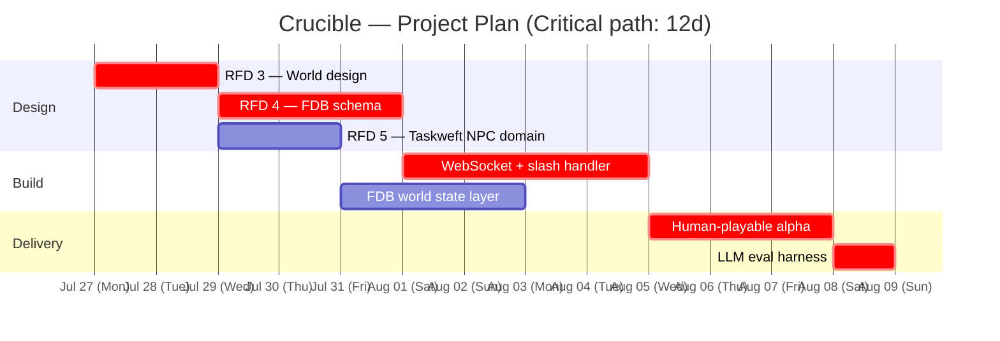

# Crucible — PERT Critical Path Plan

Generated from `taskweft/taskweft` planner (temporal HTN domain).

## Dependencies

- RFD 3 (World design) and RFD 4 (FDB schema) depend on RFD 2 (project def)
- Taskweft NPC domain depends on RFD 3 + RFD 4
- WebSocket handler depends on Taskweft NPC domain
- Human-playable alpha depends on all above
- Eval harness depends on alpha

## Critical path (12 days)

## Stack

- **libh2o** — dual-stack HTTP/1.1 + HTTP/3, WebSocket, slash-command dispatch
- **FoundationDB** — world state persistence
- **Taskweft** — HTN planner for NPC behavior + scenario logic
