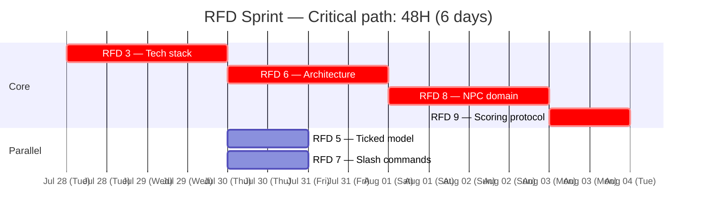

# Crucible — RFD Sprint PERT Plan

Generated from `taskweft/taskweft` planner.

## Schedule (58H serial / 48H parallel critical path)

## Estimates

| RFD | Hours | Critical |
|-----|-------|----------|
| 3 — Tech stack | 16 | ✓ |
| 5 — Ticked model | 4 | — |
| 6 — Architecture | 12 | ✓ |
| 7 — Slash protocol | 6 | — |
| 8 — NPC domain | 12 | ✓ |
| 9 — Scoring | 8 | ✓ |
| **Total** | **58** | **48** |

RFD 5 and 7 run in parallel with RFD 6 (both depend on RFD 3, neither
depends on RFD 6). Planner output shows 58H serial because HTN produces
a total order; true parallel schedule is 48H on the critical path.
